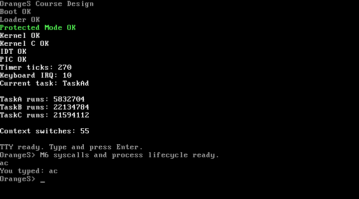

# OrangeS 课程设计

参考《Orange'S：一个操作系统的实现》的设计路线，自主完成一个可启动、可交互、可演示的 x86 操作系统雏形，并在此基础上扩展 Shell 和系统命令。

## 项目信息

- 课程：操作系统课程设计
- 小组成员：徐千顺、赵晴
- 参考方向：OrangeS `chapter11/c`
- 当前阶段：M6 文件系统与系统调用已完成，下一阶段为 M7 Shell 与命令扩展
- 主要模拟器：QEMU；Bochs 作为可选调试工具

当前仓库不包含 OrangeS 参考源码或预生成磁盘镜像。Boot Sector、Loader、C 内核、中断和进程调度均为小组自主实现；后续代码应按照路线图逐步实现，并明确记录参考来源和小组贡献。

## 快速开始

推荐使用 Docker 中的固定开发环境：

```bash
make docker-build
make docker-check
make docker-test
make docker-shell
```

进入开发容器后，可以构建并在 QEMU 终端界面启动 M6 镜像：

```bash
make image
make run
make screenshot
```

`make run` 默认展示 10 秒后自动退出；可通过 `make run RUN_TIMEOUT=30s` 调整展示时间。

也可以在 Ubuntu 24.04 上安装本机依赖后运行：

```bash
make check-env
```

具体依赖和运行方式见 [开发指南](docs/development.md)。

## M6 启动结果

系统使用标准 1.44 MB FAT12 镜像。Boot Sector 从根目录装载 `LOADER.BIN`，Loader 再装载 `KERNEL.BIN`、开启 A20、建立 GDT 并进入 32 位保护模式。Kernel 在 M5 TTY 上增加 `int 0x80` 调用门、RAM 文件系统和动态子进程：

```text
OrangeS Course Design
Boot OK
Loader OK
Protected Mode OK
Kernel OK
Kernel C OK
IDT OK
PIC OK
TIMER IRQ OK
KEYBOARD IRQ OK
TASK A OK
TASK B OK
TASK C OK
SCHEDULER OK
TTY READY
TTY LINE ac
TTY OK
SYSCALL INT OK
FS SYSCALLS OK
EXEC CHILD OK
FORK EXEC WAIT OK
```



`make test` 会检查引导签名、FAT12 文件、碎片化簇链、启动顺序以及 Loader/Kernel 缺失路径，并通过 QEMU debugcon 验证 Kernel 确实在保护模式下执行。

M6 提供 `open/read/write/close/stat/unlink` 系统调用和 8 文件、每文件 512 字节的内存文件系统。进程表保留三个常驻任务并增加五个动态槽位；`fork` 复制任务栈和返回现场，`exec` 切换到注册程序入口，`wait` 阻塞父进程直至子进程退出。当前文件系统为断电即失的 RAM FS，用户程序仍与内核链接在同一 Ring 0 地址空间。

## 目录结构

| 目录 | 计划职责 |
| --- | --- |
| `boot/` | Boot Sector、Loader 与保护模式切换 |
| `kernel/` | 内核入口、中断、调度、TTY 和设备管理 |
| `include/` | 汇编与 C 代码共享的接口和常量 |
| `lib/` | 内核及用户态公共函数、系统调用封装 |
| `mm/` | 进程创建、退出和程序加载等内存管理服务 |
| `fs/` | 文件系统服务和文件相关系统调用 |
| `command/` | Shell 及用户态命令程序 |
| `scripts/` | 环境检查、镜像制作和自动化脚本 |
| `tests/` | 构建与运行回归测试 |
| `docs/` | 需求、架构、路线图、过程记录和报告提纲 |
| `assets/screenshots/` | 启动、命令和验收截图 |

## 项目文档

- [课程与选题要求](docs/requirements.md)
- [实施路线图](docs/roadmap.md)
- [计划架构](docs/architecture.md)
- [开发指南](docs/development.md)
- [工作量与进度记录](docs/progress.md)
- [项目报告提纲](docs/report-outline.md)
- [参考资料与引用规则](docs/references.md)

## 预期成果

- 能从磁盘镜像启动并进入保护模式和内核。
- 支持中断、时钟、键盘、TTY、单进程和多进程。
- 支持基础文件系统、系统调用和简单 Shell。
- 实现 `help`、`clear`、`cat`、`stat`、`rm` 等扩展命令。
- 提交具有阅读导航的项目文档、源码托管链接、演示材料和答辩材料。
