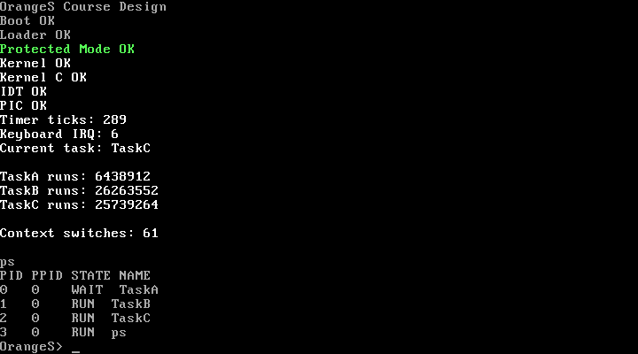

# 摘要

本项目参考《Orange'S：一个操作系统的实现》的实验路线，自主实现一个可从 FAT12 软盘镜像启动的 32 位 x86 操作系统雏形。系统完成 Boot Sector、二级 Loader、保护模式、C 内核、中断、抢占式多任务、键盘与 TTY、内存文件系统、系统调用、进程生命周期、Shell 和命令扩展。最终系统能够在 QEMU 中稳定启动，交互执行 `help`、`clear`、`cat`、`stat`、`rm`、`ps`，并由自动测试覆盖正常路径和关键失败路径。

项目不提交随书源码和预生成系统镜像。参考实现只用于理解模块职责和控制流；启动地址、系统调用 ABI、任务现场、RAM FS、命令实现及测试脚本均按本项目约束编写。

# 1. 项目概述

## 1.1 目标与范围

课程设计的核心目标是把课堂中的进程、中断、文件和系统调用概念落实为一条可运行链路。项目按 M0 至 M8 推进，最低目标包括：

- 从 1.44 MB FAT12 镜像启动，装载 Loader 和 Kernel。
- 进入 32 位保护模式，建立 GDT、IDT、PIC、PIT 和键盘中断。
- 运行三个独立内核任务，并由 Timer IRQ 抢占轮转。
- 提供字符输入、行编辑、控制台输出和 Shell。
- 经 `int 0x80` 提供文件与进程系统调用。
- 支持 `help`、`clear`、`cat`、`stat`、`rm`，并扩展 `ps`。
- 使用可重复的 QEMU 场景验证启动、交互、异常结果和回归行为。

## 1.2 小组分工

| 成员 | 主要负责范围 | 里程碑 |
| --- | --- | --- |
| 徐千顺 | 仓库与工具链、Boot Sector、Loader、保护模式、内核中断、三个常驻任务和抢占式调度 | M0–M4 |
| 赵晴 | 键盘字符缓冲、VGA 控制台、TTY、RAM FS、系统调用、fork/exec/wait、Shell、命令、ps、回归测试和交付文档 | M5–M8 |

每项成果在 `docs/progress.md` 中对应到提交哈希、源码路径、测试日志或截图，避免使用无法复核的“参与开发”描述。

# 2. 开发与运行环境

固定开发环境基于 Ubuntu 24.04，仓库提供 Dockerfile；本次最终验收也在 Windows WSL2 的 Ubuntu 24.04 中执行同一套 Make 目标。

| 工具 | 验收版本 | 用途 |
| --- | --- | --- |
| NASM | 2.16.01 | 16 位引导代码与 32 位内核入口汇编 |
| GCC | 13.3.0 | `-m32 -ffreestanding` C 编译 |
| GNU Binutils | 2.42 | ELF32 链接、检查与平坦二进制转换 |
| GNU Make | 4.3 | 统一构建、测试、运行、截图和报告入口 |
| mtools | 4.0.43 | 无需挂载或 sudo 地创建 FAT12 镜像 |
| QEMU | 8.2.2 | x86 启动、键盘注入、debugcon 和截图 |
| Pandoc | 3.x/兼容版本 | 从 Markdown 生成带目录的 Word 报告 |

仓库使用 `.gitattributes` 固定脚本和源码为 LF，避免 Windows Git 将 Shell 脚本检出为 CRLF。所有中间产物写入 `build/`，磁盘镜像由 Makefile 重建，不依赖手工挂载。

# 3. 系统总体设计

## 3.1 启动链路

```text
BIOS
  -> Boot Sector（查找并加载 LOADER.BIN）
  -> Loader（加载 KERNEL.BIN、开启 A20、建立 GDT）
  -> 32 位保护模式 Kernel
  -> IDT / 8259A PIC / PIT / Keyboard IRQ
  -> 三任务抢占式调度
  -> TTY / VGA Console
  -> int 0x80 / RAM FS / 动态子进程
  -> Shell / cat / stat / rm / ps
```

Boot Sector 由 BIOS 加载到 `0x7c00`，Loader 位于 `0x90100`，Kernel 入口位于线性地址 `0x10000`。Loader 建立 `0x08` 代码段和 `0x10` 数据段，进入内核时使用 `0x9f000` 作为临时栈顶。

## 3.2 模块边界

- `boot/`：FAT12 文件查找、早期装载、A20、GDT 和模式切换。
- `kernel/`：内核入口、异常/IRQ 汇编现场、PIC/PIT、键盘、控制台、TTY 和系统调用分发。
- `mm/`：动态进程槽位、程序注册以及 fork/exec/wait/exit 生命周期。
- `fs/`：RAM 文件、打开句柄、读写位置、stat 和 unlink。
- `lib/`：字符串函数和 `int 0x80` 用户侧封装。
- `command/`：Shell 解析以及仅通过系统调用工作的命令程序。
- `tests/`、`scripts/`：构建检查、QEMU 启动回归和确定性键盘注入。

## 3.3 中断与调度

IRQ0/IRQ1 分别映射为 `0x20/0x21`。汇编入口保存段寄存器、`pushad` 通用寄存器组、IRQ 占位和 IRET 现场，形成 64 字节 `STACK_FRAME`。Timer 频率为 100 Hz，固定 5 tick 时间片在可运行进程之间轮转。

系统保留 TaskA、TaskB、TaskC 三个常驻任务。TaskA 负责 TTY 和 Shell，TaskB/TaskC 继续作为可观察的调度负载。进程表共有 8 个槽位，额外槽位用于 Shell 子进程。

# 4. 分阶段实现

## 4.1 M0–M4：启动、内核与调度

M0 建立仓库、容器、文档和 CI；M1 完成严格 512 字节、带 `55aa` 签名的 Boot Sector；M2 增加 FAT12 Loader、A20、GDT、保护模式和 Kernel 装载；M3 完成 C 入口、IDT、8259A、PIT 和键盘 IRQ；M4 构造三个独立任务栈并实现抢占式轮转。

这些阶段共同提供了后续扩展所复用的启动链、IRQ 保存/恢复和 `p_proc_ready` 调度钩子，M5–M8 没有复制或替换它们。

## 4.2 M5：输入输出系统

键盘 IRQ 从端口 `0x60` 读取 Set 1 扫描码，跟踪 Shift 和 Caps Lock，并将可打印字符、退格、Tab、回车写入 128 字节环形缓冲区。中断上下文只负责翻译与入队，TaskA 中的 `tty_poll()` 非阻塞消费字符。

VGA 控制台使用文本模式第 18 至 24 行，保留上方调度信息。`console_putc()` 统一处理光标、换行、Tab、退格和局部滚屏。TTY 使用 64 字节行缓冲，回车后把完整命令交给 Shell。

## 4.3 M6：文件系统与系统调用

IDT 的 `0x80` 项使用可由低特权级调用的中断门属性。调用号置于 EAX，最多三个参数置于 EBX、ECX、EDX，返回值写回保存的 EAX。系统调用现场与 IRQ 使用相同 `STACK_FRAME`，因此 `exit` 或 `wait` 触发调度后可从新的 `p_proc_ready` 恢复。

| 调用号 | 接口 | 行为 |
| ---: | --- | --- |
| 0 | `write` | 写标准输出或已打开文件 |
| 1–5 | `open/read/close/stat/unlink` | RAM FS 基础文件操作 |
| 6–9 | `fork/exec/wait/exit` | 动态子进程生命周期 |
| 10 | `process_list` | 复制只读进程快照 |

RAM FS 最多保存 8 个文件，每个文件上限 512 字节，最多同时打开 8 个句柄。句柄从 3 开始并记录所有者、当前位置和打开标志。系统启动时创建 `readme.txt` 与 `hello.txt`。

`fork` 复制当前 8 KiB 任务栈和系统调用返回现场。由于所有进程共享平坦地址空间，复制后的 EBP 仍会指向父栈，因此实现继续沿保存的调用帧链重定位 EBP。`exec` 把 IRET 的 EIP 替换为注册程序入口；`wait` 阻塞父进程；`exit` 写回状态、唤醒父进程并回收子槽位。

## 4.4 M7：Shell 与命令

Shell 分离命令名和单个文件参数。`help`、`clear` 为内建命令，未知命令给出可见提示。`cat`、`stat`、`rm` 为注册程序，Shell 对每条命令执行 `fork -> exec -> wait`，命令代码只调用 `lib/syscall.c` 暴露的接口。

- `cat FILE`：分块读取并写到标准输出。
- `stat FILE`：输出 inode 和字节数。
- `rm FILE`：删除未被打开的文件。
- 参数缺失或文件不存在时返回非零状态并显示原因。

## 4.5 M8：进程信息与交付

`ps` 通过 `process_list` 系统调用取得快照，不直接访问 `proc_table`。快照包含 PID、PPID、状态和名称。运行 `ps` 时可看到等待子进程的 TaskA、持续运行的 TaskB/TaskC，以及 `ps` 自身。

最终回归加入 `cat`、`stat`、`rm` 的正常和不存在文件路径，QEMU 键盘注入显式使用 20 ms 保持时间和 30 ms 字符间隔，降低模拟输入丢键的不确定性。

# 5. 自定义扩展与关键问题

## 5.1 相对基础路线的扩展

项目在课程主线外增加了可复现测试、无挂载 FAT12 构建、局部滚屏控制台、动态程序注册、只读进程快照、`ps` 和统一截图入口。Shell 命令不是直接调用内核内部函数，而是复用真实的系统调用与进程生命周期。

## 5.2 问题与解决

1. Windows 检出脚本为 CRLF：WSL 报错 `/usr/bin/env: bash\r`。添加 `.gitattributes` 固定 LF，并用仓库本地配置验证。
2. fork 子进程无法进入 exec：日志显示 `forked` 被反复调度。原因是保存的 EBP 指向父栈；复制后重定位调用帧链解决。
3. 任务名显示残影：从 `forked` 切回较短的 `TaskC` 时剩余字符未覆盖。调度器写名称前清空 16 字节字段。
4. QEMU 偶发丢键：默认按键保持时间与连续注入重叠。脚本显式设置保持时间并加入字符间隔。

# 6. 测试与演示

## 6.1 自动测试

最终验收命令：

```bash
make clean
make check-env
make test
make screenshot
make report
```

`make test` 检查以下内容：

- Boot Sector 大小、签名、FAT12 镜像大小和文件目录。
- Loader/Kernel 缺失时的明确错误，以及碎片化 Loader 簇链。
- 保护模式、C 内核、IDT、PIC、Timer/Keyboard IRQ。
- TaskA -> TaskB -> TaskC 轮转和动态子进程恢复。
- 扫描码转换、退格编辑、TTY 回车提交。
- 文件创建、写入、读取、stat、unlink 和不存在错误。
- fork/exec/wait/exit 与退出状态 7。
- help、clear、未知命令、cat、stat、rm、ps。
- Kernel ELF32/i386 属性、必需符号和 64 KiB 装载上限。

2026-09-06 最终冷构建生成的 `kernel.bin` 为 14,048 字节，全部测试通过。

## 6.2 最终截图



截图中 TaskA 为 WAIT，说明 Shell 正等待 `ps` 子进程；TaskB、TaskC 和 `ps` 为 RUN。命令退出后 `OrangeS>` 提示符恢复，证明父进程被唤醒。

# 7. 项目管理与可追溯性

| 阶段 | 代表提交 | 内容 |
| --- | --- | --- |
| M0–M4 | `ac527c2`–`70cdb77` | 工具链、启动、保护模式、中断和调度 |
| M5 | `5e55e2c`、`0ad08bf` | 键盘缓冲、控制台和 TTY |
| M6 | `3dfaf33`、`52338a8` | RAM FS、系统调用和进程生命周期 |
| M7 | `01acdeb`、`0a1cc1f` | Shell 内建与文件命令 |
| M8 | `ea7942e`、`b99f85d` | ps、错误路径和最终回归 |

所有阶段保持小步提交并在完成后推送。源码、测试输出、截图和 `docs/progress.md` 共同构成工作量证据。

# 8. 已知限制与总结

当前系统仍是课程规模原型：RAM FS 不持久化；文件名、文件数和单文件大小固定；命令只支持一个文件参数；程序与内核链接在同一 Ring 0 平坦地址空间；没有页表、用户地址空间隔离、磁盘写回和完整 POSIX 语义。

尽管存在这些边界，项目已经贯通“BIOS 启动—保护模式—中断—抢占调度—TTY—系统调用—文件系统—进程—Shell”的完整控制流。实现过程中通过自动测试定位了栈地址、显示残影和输入时序问题，最终成果可以从干净环境重复构建、启动、交互和验收。

# 参考资料

1. 于渊，《Orange'S：一个操作系统的实现》。
2. 随书源码 `chapter4/c`、`chapter5/f`、`chapter7/n`、`chapter8/_base_`、`chapter11/c`，仅用于结构与机制对照。
3. 课程提供的《2026 操作系统课程设计课程说明》《操作系统课程设计要求》和项目 A 选题说明。
4. QEMU、NASM、GCC、GNU Binutils 与 mtools 官方文档。
